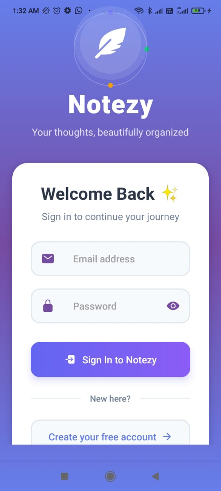
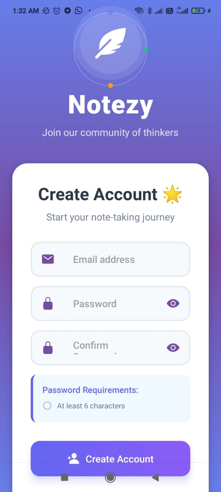
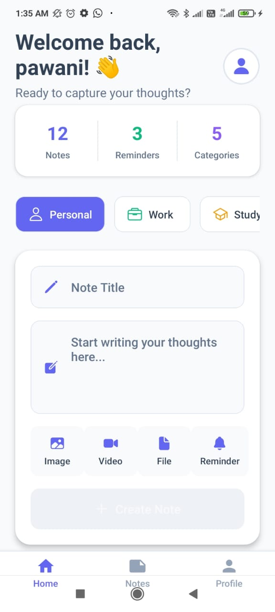
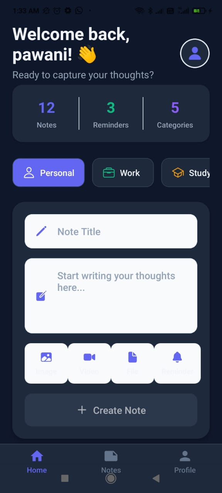
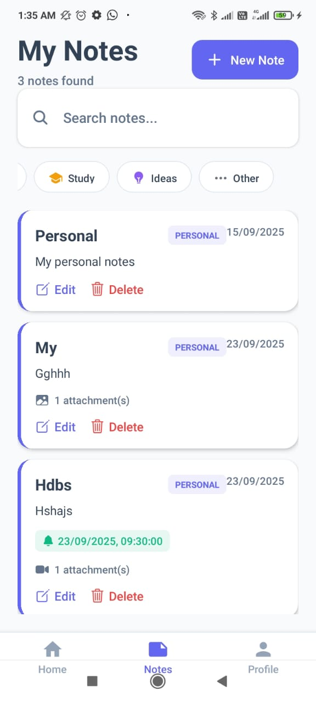
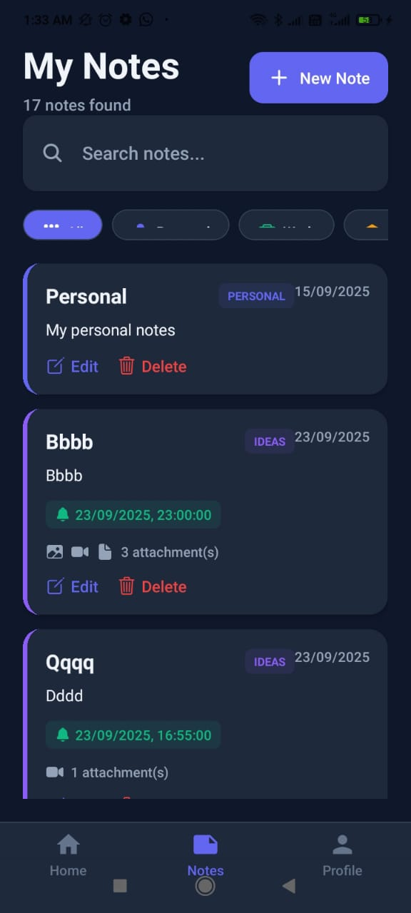
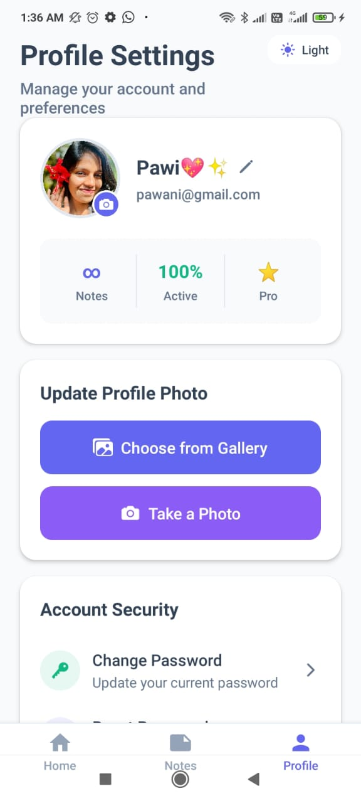
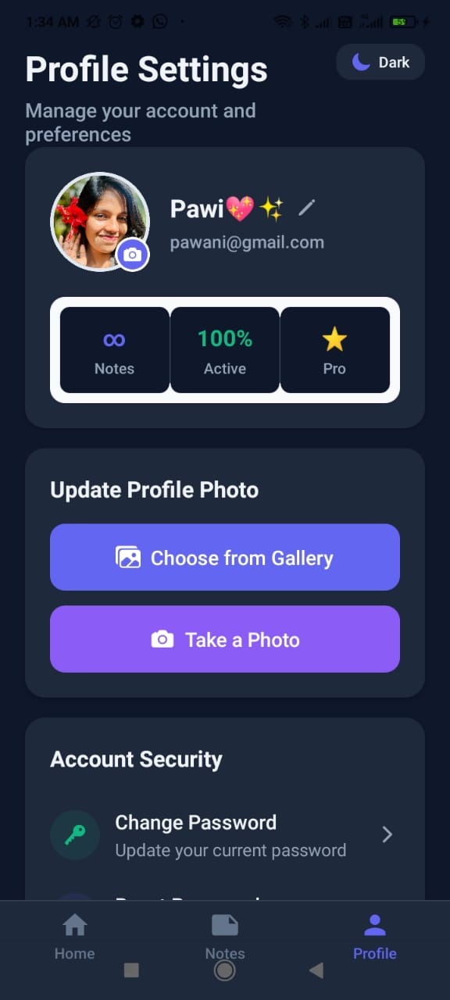

# 📝 Notezy – Your Minimal & Smart Note App

**Notezy** is a modern, lightweight mobile note-taking app built with **React Native + Expo**. Effortlessly create, organize, and manage your thoughts with multimedia attachments, smart categories, and reminders. Designed for clarity, speed, and productivity on the go.  

---

## 📱 App Preview

| Screen | Light Theme | Dark Theme |
|--------|------------|------------|
| Login |  |  |
|Home |  |  |
| Notes |  |  |
| Profile |  |  |
| Profile |  |  |


---

## 🎬 Demo

Experience Notezy in action:  
[Watch Demo Video](https://youtube.com/your-demo-link)

---

## ✨ Core Features

### 📝 Note Management
- Create, edit, and delete notes effortlessly  
- Auto-sorted by creation date  
- Search, filter, and categorize notes  

### 🏷 Categories & Tags
- Predefined categories: Personal, Work, Study, Ideas, Other  
- Color-coded notes for quick visual identification  

### 📂 Attachments
- Add **images, videos, and files** to your notes  
- Uploads via **Cloudinary or Firebase Storage**  
- Preview media directly in-app  

### ⏰ Reminders & Notifications
- Schedule smart reminders for important notes  
- Push notifications using **Expo Notifications**  

### 🔒 Secure Authentication
- Firebase Auth (Email/Password)  
- Protected routes for secure note access  

### 🎨 Sleek UI/UX
- Minimalist, responsive design  
- Smooth navigation with **bottom tabs**  
- Engaging, user-friendly interface  

---

## 🛠 Technology Stack

| Layer | Technology |
|-------|------------|
| **Framework** | React Native |
| **Development Tool** | Expo |
| **Language** | TypeScript |
| **Backend & Database** | Firebase Firestore & Auth |
| **Storage** | Firebase Storage / Cloudinary |
| **Navigation** | Expo Router |
| **Notifications** | Expo Notifications |
| **Styling** | React Native StyleSheet |

---

## ⚙️ Installation & Setup

### Prerequisites
- Node.js ≥ 16  
- npm or yarn  
- Expo CLI (`npm install -g expo-cli`)  
- Android Studio / Xcode (for emulator testing)

### Steps
1. **Clone Repository**
```bash
git clone https://github.com/dilshag/Notezy---Note-Taking-App
cd notezy
